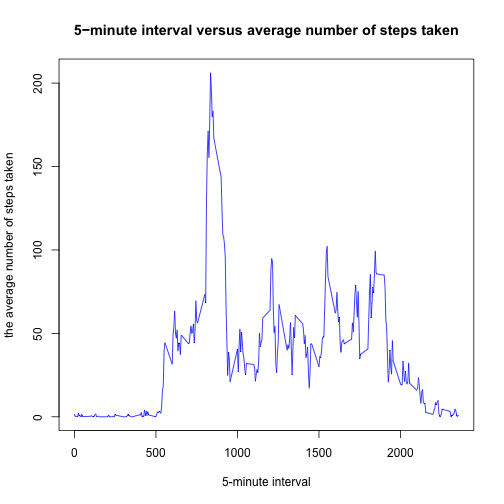
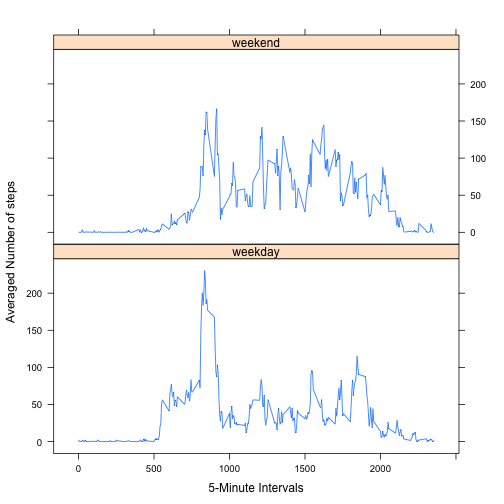

## Loading and preprocessing the data

1. Load the data (i.e. read.csv())

```r
unzip("activity.zip")
activity_data <- read.csv("activity.csv", header=TRUE, na.strings= "NA")
head(activity_data)
```

```
##   steps       date interval
## 1    NA 2012-10-01        0
## 2    NA 2012-10-01        5
## 3    NA 2012-10-01       10
## 4    NA 2012-10-01       15
## 5    NA 2012-10-01       20
## 6    NA 2012-10-01       25
```

```r
tail(activity_data)
```

```
##       steps       date interval
## 17563    NA 2012-11-30     2330
## 17564    NA 2012-11-30     2335
## 17565    NA 2012-11-30     2340
## 17566    NA 2012-11-30     2345
## 17567    NA 2012-11-30     2350
## 17568    NA 2012-11-30     2355
```

2. Process/transform the data (if necessary) into a format suitable for your analysis

```r
class(activity_data$date)
```

```
## [1] "factor"
```

```r
activity_data$date <- as.Date(activity_data$date)

class(activity_data$date)
```

```
## [1] "Date"
```

## What is mean total number of steps taken per day?

1. Make a histogram of the total number of steps taken each day

```r
total_steps <- tapply(activity_data$steps, activity_data$date, FUN=sum)

hist(total_steps,
breaks=11,
freq=TRUE,
main="Histogram of total number of steps taken each day",
xlab="Total number of steps taken per day")
```

 

2. Calculate and report the mean and median total number of steps taken per day

```r
mean_steps <- mean(total_steps, na.rm=TRUE)
median_steps<- median(total_steps, na.rm=TRUE)
```

```r
mean_steps
```

```
## [1] 10766.19
```

```r
median_steps
```

```
## [1] 10765
```


## What is the average daily activity pattern?

1. Make a time series plot (i.e. type = "l") of the 5-minute interval (x-axis) and the average number of steps taken, averaged across all days (y-axis)

```r
avg_steps <- aggregate(x=list(steps=activity_data$steps),
              by=list(interval=activity_data$interval),
              FUN=mean,
              na.rm=TRUE)

plot(avg_steps$steps~avg_steps$interval,
     type="l",
     col="blue",
     main="5−minute interval versus average number of steps taken",
     xlab="5-minute interval",
     ylab="the average number of steps taken")
```

```
## Warning in title(...): conversion failure on '5−minute interval versus
## average number of steps taken' in 'mbcsToSbcs': dot substituted for <e2>
```

```
## Warning in title(...): conversion failure on '5−minute interval versus
## average number of steps taken' in 'mbcsToSbcs': dot substituted for <88>
```

```
## Warning in title(...): conversion failure on '5−minute interval versus
## average number of steps taken' in 'mbcsToSbcs': dot substituted for <92>
```

 

2. Which 5-minute interval, on average across all the days in the dataset, contains the maximum number of steps?

```r
avg_steps[which.max(avg_steps$steps),]
```

```
##     interval    steps
## 104      835 206.1698
```


## Imputing missing values

1. Calculate and report the total number of missing values in the dataset (i.e. the total number of rows with NAs)

```r
table(is.na(activity_data))
```

```
## 
## FALSE  TRUE 
## 50400  2304
```

2. Devise a strategy for filling in all of the missing values in the dataset. The strategy does not need to be sophisticated. For example, you could use the mean/median for that day, or the mean for that 5-minute interval, etc.


```r
value_filled <- function(steps, interval) {
  filled <- NA
  if (!is.na(steps))
    filled <- steps
  else
    filled <- avg_steps[avg_steps$interval==interval, "steps"]
  return(filled)
}
```

3. Create a new dataset that is equal to the original dataset but with the missing data filled in.

```r
activity_data_new <- activity_data
activity_data_new$steps <- mapply(value_filled, activity_data_new$steps, activity_data_new$interval)
# show that the missing values are gone
table(is.na(activity_data_new))
```

```
## 
## FALSE 
## 52704
```

4. Histogram of the total number of steps taken each day using the new data set


```r
total_steps_new <- tapply(activity_data_new$steps, activity_data_new$date, FUN=sum)

hist(total_steps_new,
     breaks=11,
     freq=TRUE,
     main="Histogram of total number of steps taken each day",
     xlab="total number of steps taken per day")
```

 

Mean and Median total number of steps taken per day

```r
mean_new <- mean(total_steps_new, na.rm=TRUE)
median_new <- median(total_steps_new, na.rm=TRUE)
```

Let’s compare the new mean and median to those we calculated above

```r
mean_steps<mean_new
```

```
## [1] FALSE
```

```r
median_steps < median_new
```

```
## [1] TRUE
```


## Are there differences in activity patterns between weekdays and weekends?

1. Create a new factor variable in the dataset with two levels – “weekday” and “weekend” indicating whether a given date is a weekday or weekend day.

```r
activity_data_new$date <- as.Date(activity_data_new$date)
activity_data_new$weekdays <- factor(format(activity_data_new$date, "%A"))
levels(activity_data_new$weekdays) <- list(weekday = c("Monday", "Tuesday","Wednesday",
                                                       "Thursday", "Friday"),
                                           weekend = c("Saturday", "Sunday"))
```

Let's check new data

```r
head(activity_data_new)
```

```
##       steps       date interval weekdays
## 1 1.7169811 2012-10-01        0  weekday
## 2 0.3396226 2012-10-01        5  weekday
## 3 0.1320755 2012-10-01       10  weekday
## 4 0.1509434 2012-10-01       15  weekday
## 5 0.0754717 2012-10-01       20  weekday
## 6 2.0943396 2012-10-01       25  weekday
```

```r
tail(activity_data_new)
```

```
##           steps       date interval weekdays
## 17563 2.6037736 2012-11-30     2330  weekday
## 17564 4.6981132 2012-11-30     2335  weekday
## 17565 3.3018868 2012-11-30     2340  weekday
## 17566 0.6415094 2012-11-30     2345  weekday
## 17567 0.2264151 2012-11-30     2350  weekday
## 17568 1.0754717 2012-11-30     2355  weekday
```

2. Make a panel plot containing a time series plot (i.e. type = "l") of the 5-minute interval (x-axis) and the average number of steps taken, averaged across all weekday days or weekend days (y-axis). See the README file in the GitHub repository to see an example of what this plot should look like using simulated data.


```r
library(lattice)
avg_steps_new <- aggregate(steps ~ interval + weekdays, data=activity_data_new, mean)
xyplot(avg_steps_new$steps ~ avg_steps_new$interval | avg_steps_new$weekdays,
       layout = c(1, 2),
       type = "l",
       xlab = "5-Minute Intervals",
       ylab = "Averaged Number of steps")
```

 
